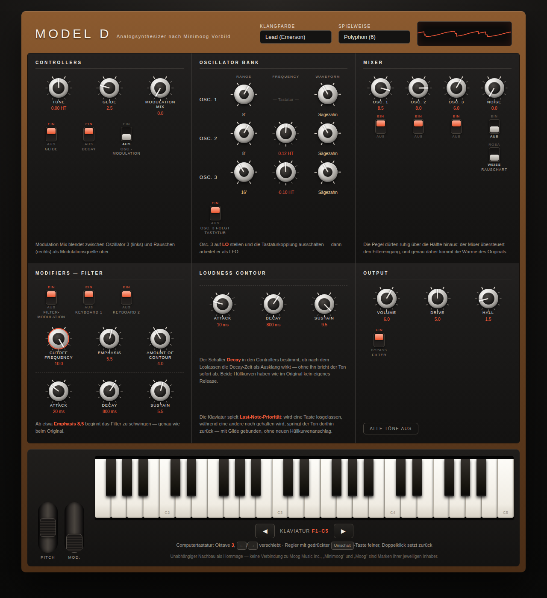

# Model D — Analogsynthesizer im Browser

Ein monophoner (wahlweise 6-stimmiger) Synthesizer nach dem Vorbild des
**Minimoog Model D**, vollständig in Web Audio umgesetzt. Kein Framework,
keine Abhängigkeiten, keine Samples — jeder Ton wird in Echtzeit berechnet.



## Starten

Die Seite muss über HTTP ausgeliefert werden (AudioWorklet-Module lassen sich
nicht über `file://` laden):

```bash
python3 -m http.server 8000
# oder
npx http-server -p 8000
```

Dann <http://localhost:8000> öffnen und auf **Einschalten** klicken.

## Spielen

| Bedienung | Wirkung |
|---|---|
| Tasten antippen | spielen (auch mit mehreren Fingern) |
| ◀ ▶ unter der Klaviatur | Tastenumfang oktavweise verschieben |
| `Z S X D C V G B H N J M` | untere Oktave |
| `Q 2 W 3 E R 5 T 6 Y 7 U` | obere Oktave |
| `←` / `→` | Oktave verschieben |
| Regler ziehen (hoch/runter) | Wert ändern |
| `Umschalt` + ziehen | Feineinstellung |
| Doppelklick auf Regler | Grundstellung |
| Mausrad über Regler | schrittweise ändern |
| Tab + Pfeiltasten | Bedienung ohne Maus |

Über der Klaviatur liegen **Pitch**- und **Modulationsrad**; das Pitchrad
federt beim Loslassen in die Mitte zurück.

## Auf dem Handy

Läuft im mobilen Browser (Chrome, Safari ab iOS 14.6). Ein paar Dinge sind
dort anders gelöst:

- **Mehrfingerspiel**: jeder Finger wird einzeln verfolgt, im Polyphon-Modus
  lassen sich also Akkorde greifen.
- **Tastenumfang**: passen die 44 Tasten nicht mehr mit mindestens 30 px pro
  weißer Taste auf den Bildschirm, wird der Ausschnitt verkleinert und beginnt
  bei C3. Mit den Tasten **◀ ▶** unter der Klaviatur verschiebt er sich
  oktavweise. Beim Drehen des Geräts wird neu aufgeteilt.
- **Regler** sind auf Geräten ohne Mauszeiger größer; bedient werden sie durch
  Ziehen nach oben und unten.

Zwei Einschränkungen, die vom Gerät kommen und nicht vom Programm:

- Steht das iPhone auf **lautlos**, gibt Web Audio nichts aus — der
  Klingelschalter muss umgelegt sein.
- Der **Polyphon-Modus** rechnet sechs Stimmen mit Ladder-Filter in Software.
  Auf älteren Telefonen kann das knacken; monophon ist dort die sichere Wahl.

## Aufbau des Klangwegs

```
Osc 1 ┐
Osc 2 ├─► Mixer ─► Ladder-Filter (24 dB/Okt) ─► VCA ─► Drive ─► Ausgang
Osc 3 │        ▲                                  ▲
Noise ┘        │                                  │
        Filter-Hüllkurve                  Loudness-Hüllkurve
```

### Oszillatoren

Drei Oszillatoren mit je sechs Fußlagen (LO, 32′ … 2′) und den sechs
Wellenformen des Originals: Dreieck, Dreieck/Säge, Sägezahn, Rechteck sowie
zwei Pulsbreiten. Die Wellenformen sind mit **PolyBLEP** bandbegrenzt, klingen
also auch in hohen Lagen sauber. Eine langsame Zufallsverstimmung pro
Oszillator sorgt für das leichte Schweben echter analoger Schaltungen.

Oszillator 3 lässt sich von der Tastatur abkoppeln und auf `LO` stellen —
dann arbeitet er als LFO und moduliert über den **Modulation Mix** (Überblendung
Osc 3 ↔ Rauschen) die Tonhöhe und/oder die Filterfrequenz.

### Filter

Das Herzstück ist das nichtlineare Transistor-Ladder-Modell nach
**Huovilainen (2004)**: vier Tiefpassstufen mit `tanh`-Sättigung, zweifach
überabgetastet, mit halber Sample-Verzögerung in der Rückkopplung. Daraus
ergeben sich die typischen Eigenschaften des Vorbilds — 24 dB/Oktave Flankensteilheit,
Selbstoszillation ab hoher Emphasis und der charakteristische Rückgang des
Bassanteils bei aufgedrehter Resonanz.

Die Tastaturkopplung des Filters ist wie im Original in zwei Schaltern zu
je ⅓ und ⅔ ausgeführt.

### Hüllkurven

Zwei ADS-Hüllkurven mit exponentiellen Segmenten. Ein Release gibt es beim
Original nicht — stattdessen entscheidet der Schalter **Decay**, ob die
Decay-Zeit auch für den Ausklang gilt.

## Aufbau des Projekts

```
index.html                  Bedienfeld als Markup
css/synth.css               Gestaltung des Panels
js/main.js                  Verdrahtung von Oberfläche und Klangerzeugung
js/engine.js                Audio-Graph, Stimmverwaltung, Parameter-Routing
js/presets.js               Werksklänge
js/ui/controls.js           Drehregler, Wahlschalter, Kippschalter, Räder
js/ui/keyboard.js           Klaviatur (Maus, Touch, Computertastatur)
js/worklets/voice-processor.js   die komplette DSP einer Stimme
test/dsp-test.mjs           Prüfung der DSP außerhalb des Browsers
```

Die gesamte Klangerzeugung läuft im Audio-Thread (`AudioWorklet`). Die
Oberfläche schickt kontinuierliche Werte als `AudioParam` und Schalterstellungen
als Nachricht an die Stimmen.

## Tests

```bash
node test/dsp-test.mjs
```

Der Test stubbt die AudioWorklet-Umgebung und rendert den Prozessor blockweise:
er prüft Tonhöhengenauigkeit, alle Wellenform/Fußlagen-Kombinationen auf
NaN und Stille, Selbstoszillation und Stabilität des Filters, das Ausklingen
nach dem Loslassen sowie das Verhalten nahe der Nyquist-Grenze.

## Browser

Nötig ist `AudioWorklet` — Chrome, Edge, Firefox und Safari ab Version 14.6.
Getestet wurde in Chromium, auch mit den Viewports von iPhone 13, iPhone SE
und Pixel 7 samt Mehrfinger-Bedienung.

## Zur Konsole

Nach dem Einschalten liegt die Engine unter `window.modelD`:

```js
modelD.setParam('cutoff', 0.25);
modelD.setConfig('osc1Wave', 3);
modelD.noteOn(48); modelD.noteOff(48);
```

## Hinweis

Unabhängiger Nachbau als Hommage an ein Stück Instrumentenbaugeschichte.
Keine Verbindung zu Moog Music Inc.; „Moog“ und „Minimoog“ sind Marken ihrer
jeweiligen Inhaber.
